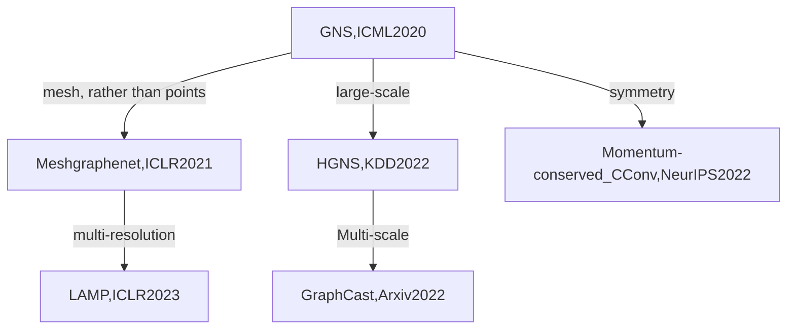
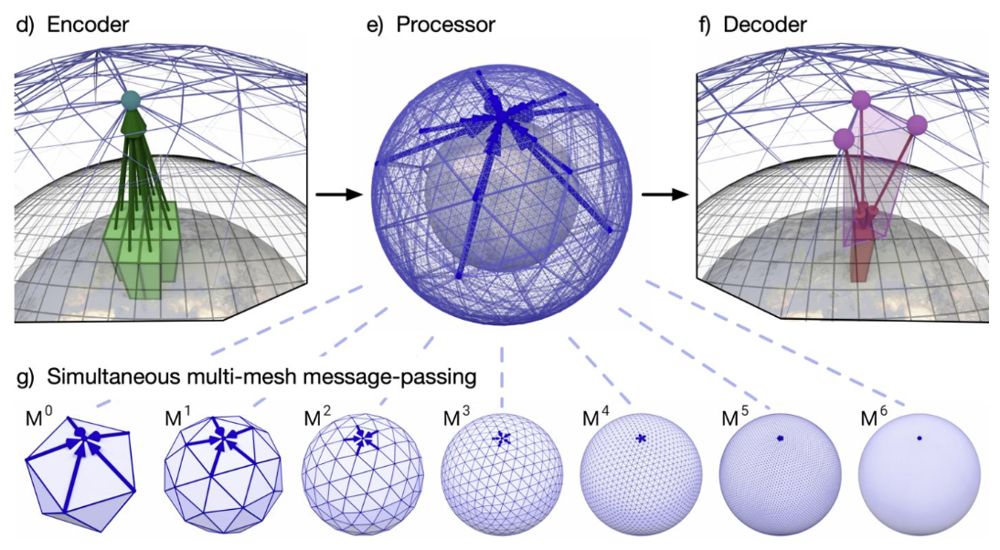

# eth-CSEseminarRobotics

> Personal literature notes for papers related to the Graph Neural Networks, PDE, Numerical Methods and Robotics.

Develop GNN-based solver will help us build the surrogate model and accelerate the scientific design. For example. we can use the GNN-solver to design the boundary condition $\rightarrow$ underwater robot shape

## GNN-based simulation

**GNN-based simulator**

- **Learning to simulate complex physics with graph networks**. *Alvaro Sanchez-Gonzalez, Jonathan Godwin, Tobias Pfaff, Rex Ying, Jure Leskovec, Peter W. Battaglia*. **ICML 2020** ([PDF](https://arxiv.org/abs/2002.09405)) (Citations **540**)

  - 
  - consturt graph $\rightarrow$ the number of dimensions don't change.(graph中vertices的数目和输入的点数目一致) ==What's the meaning of it?== 
  - **Training:** trained with 1-step prediction, minimizing MSE. To improve long-term prediction, add Gaussian noise on the input.  
    - $\epsilon \sim N(0,1), \sigma$: amplitude of noise on each feature
  - **Inference:** autoregressively rollout for hundreds of steps

- **Learning large-scale subsurface simulations with a hybrid graph network simulator**. *Tailin Wu, Qinchen Wang, Yinan Zhang, Rex Ying, Kaidi Cao, Rok Sosič, Ridwan Jalali, Hassan Hamam, Marko Maucec, Jure Leskovec*. **SIGKDD 2022** ([PDF](https://arxiv.org/pdf/2206.07680.pdf)) (Citations **4**)

  - **Task:** Subsurface fluid simulation (critical in energy, carbon capture, etc.)
  - **Main contribution:** Introduced HGNS for fluid simulation, which use
    - multi-step prediction during training to improve long-term prediction accuracy
    - Sector-based training and inference

  - **Results:** Up to 18x faster than classical solver. Apply to 10million cells per step. Deployed in industry
  - 

- **GraphCast: Learning skillful medium-range global weather forecasting**. *Peter Battagliac et. al. DeepMind*. **Arxiv 2022** ([PDF](https://arxiv.org/pdf/2212.12794.pdf))

  - **Task:** Weather forecasting (mid-range, 10-day)
  - **Main contribution:** Introduced GraphCast [1]:
    - Multi-scale GNN
    - Annealed multi-step learning objective
  - **Results:** outperforms state-of-the-art weather forecasting method (HRES) in 10-day prediction acc.
  - 

- **Learning Mesh-Based Simulation with Graph Networks**. *Tobias Pfaff, Meire Fortunato, Alvaro Sanchez-Gonzalez, Peter W. Battaglia*. **ICLR 2021 spotlight** ([PDF](pdf/learning_mesh_based_simulation.pdf))

  - **Task:** Mesh-based simulation
  - **Main contribution:** Introduced MeshGraphNets:
    - World-space edges
    - Supervised remeshing
  - **Results:** accurate prediction on many different systems.
  - 

- **Guaranteed Conservation of Momentum for Learning Particle-based Fluid Dynamics**. *Lukas Prantl, Benjamin Ummenhofer, Vladlen Koltun, Nils Thuerey*. **NeurIPS 2022** ([PDF](https://openreview.net/forum?id=6niwHlzh10U)) ([OpenReview](https://openreview.net/forum?id=6niwHlzh10U))

  - Other examples with symmetry help
    - Equivariant GNNs for molecular prediction - maxwell
    - DeepPotential - linfeng zhang

- **Learning Controllable Adaptive Simulation for Multi-resolution Physics**. *Tailin Wu, Takashi Maruyama, Qingqing Zhao, Gordon Wetzstein, Jure Leskovec*. **ICLR 2023 spotlight**([PDF](https://openreview.net/pdf?id=PbfgkZ2HdbE)) ([OpenView](https://openreview.net/forum?id=PbfgkZ2HdbE))

- **Message Passing Neural PDE Solvers.** *Johannes Brandstetter, Daniel Worrall, Max Welling*. **ICLR 2022** ([PDF](pdf/GNN-MPNNPDE.pdf))([Comment](https://mp.weixin.qq.com/s/pt0MPu1WkxhFY1fmBZ35rA))([OpenReview](https://openreview.net/forum?id=vSix3HPYKSU))

  - 

- **Multi-scale Message Passing Neural PDE Solvers.** *Leonard Equer, T. Konstantin Rusch, Siddhartha Mishra*.  **ICLR 2023 workshop Physics4ML spotlight** ([PDF](pdf/MC_MPNPDE.pdf)) ([OpenReveiw](https://openreview.net/forum?id=jhH01LKEvB))

  - 这是Mishra's group workshop paper，我觉得可以用到之前做的东西里面，把lstm换成lem看看，fem+gn $\rightarrow$ fem+gnn+lem

- **Physics-informed graph neural Galerkin networks: A unified framework for solving PDE-governed forward and inverse problems.** *Han Gao, Matthew Zahr , Jianxun Wang*. **CMAME, 2022** ([PDF](pdf/GraphGalerkinNetworks.pdf)) ([Comment](https://zhuanlan.zhihu.com/p/423445804))(Citations **55**)

  - discrete PINN based on GCN and FEM: PINN是对求解域整理点集，利用自动微分去使得ANN这个初始化的解函数逼近真实解。而discrete-PINN并没有利用自动微分，而是结合传统数值方法对方程做离散，从而求得微分算子

  - > 其实计算机求解PDE的核心思路就是如何在计算机中表达微分算子。传统计算机主要基于数值微分，但这毕竟是一种近似的方法，方程的解会存在阶段误差。而如果我们用神经网络计算里，我们可以用自动微分精确计算某点导数，从理论上来说精度是无限高的，但是会存在逼近误差，这算是神经网络做PDE solver的一个优势。那么反过来，对于积分，是否也存在可能的机器学习算法去无限逼近积分呢？而不需要做数值积分

  - 列举了一些weak form of  discrete PDEs的一些优势：

    - 微分算子的阶数会下降，并且Neuman边界条件会在推导方程残差中自动满足。这些都可以极大降低我们问题的复杂性
    - 之前用strong forms of PDEs我们要在collection of points上去逼近。现在我们只需在少量高斯点上去逼近使得loss function为0，训练难度大大下降。

- **Predicting Physics in Mesh-reduced Space with Temporal Attention**. *Xu Han, Han Gao, Tobias Pffaf, Jian-Xun Wang, Li-Ping Liu*. **ICLR 2022** ([PDF](pdf/GNN-predicting_physics_in_mesh_red.pdf))

- **Physics-constrained Unsupervised Learning of Partial Differential Equations using Meshes.** *Mike Y. Michelis, Robert K. Katzschmann.* ([Arxiv](https://arxiv.org/abs/2203.16628))

  - ==NOT clear about what is the meaning of interactive setting?==
    - our computationally efficient approach can be used as an interactive PDE solver that is adjusting boundary conditions in real-time and remains sufficiently close to the baseline solution. 这里的交互性应该是指改变边界条件，不需要重新训练网络，而是可以得到问题的解
  - Weekness of CNN for learning PDE: 
    - poor ability to han- dle complex, irregular geometries

    - fail to adaptively refine and coarsen the resolution based on how accurate solutions are in certain positions on the grid.

    - only Eulerian simulations (fixed grid) are permissible un- der the CNN formulation, hence an alternative is necessary for problems that require a Lagrangian simulation method where the grid itself moves,
  - 本文用的是pfaff的网络架构。the Graph Network architecture from Sanchez-Gonzalez et al. (2018); Pfaff et al. (2021) due to its inductive bias conducive to mesh learning. 
  - 模型信息：
    - 每个节点上的信息除了有场的值外，还有位置信息与vertex information，这些都将被作为节点特征向量。
    - 这里，$\vec{u}_{t+1}=\vec{u_t}+\Delta{\vec{u}}$. 图网络最后预测的是residual $\Delta{\vec{u}}$. $\vec{u}_{t+1}$ and $\vec{u}_t$ 被用来计算physical loss。
    - chose the limitation to just include first-order time derivatives. 这里表达的意思是，如果我们只预测一个时间步的话，则我们可以只考虑一阶时间导数，如果我们要求解更高阶的时间导数的话，我们则需要more than one time step。则可能也是为什么当时孙老师求解时用了更多的时间步。注意，这里构造的是unconditionally stable implicit/backward Euler method.
  - Training of the model
  - Questions:
    - How did they process the loss for time discrete?

- **Physics-aware Difference Graph Networks for Sparsely-Observed Dynamics**. *Sungyong Seo, Chuizheng Meng, Yan Liu*. **ICLR 2020** ([PDF](pdf/physics_aware_difference_graph.pdf))

- **Combining Differentiable PDE Solvers and Graph Neural Networks for Fluid Flow Prediction**. *Filipe de Avila Belbute-Peres, Thomas D. Economon, J. Zico Kolter*. **ICML 2020** ([PDF](pdf/CombiningPDEsolversandGNN.pdf))

- **DiffGCN: Graph Convolutional Networks via Differential Operators and Algebraic Multigrid Pooling**. *Moshe Eliasof, Eran Treister*. **NIPS 2020** ([PDF](pdf/DiffGCN.pdf))

- **Learning continuous-time PDEs from sparse data with graph neural networks.** *Valerii Iakovlev, Markus Heinonen, Harri Lähdesmäki*. **ICLR 2021** ([PDF](pdf/Learningcontinuous-timePDEs.pdf)) ([Comment](https://zhuanlan.zhihu.com/p/422011614))

- **Learning Mesh-Based Simulation with Graph Networks**. *Tobias Pfaff, Meire Fortunato, Alvaro Sanchez-Gonzalez, Peter W. Battaglia*. **ICLR 2021 spotlight** ([PDF](pdf/learning_mesh_based_simulation.pdf))

- **GRADE: A GRAPH BASED DATA-DRIVEN SOLVER FOR TIME-DEPENDENT NONLINEAR PARTIAL DIFFERENTIAL EQUATIONS**. *Yash Kumar, Souvik Chakraborty*. **2021 Arxiv** ([PDF](pdf/GNN-GRADE_A GRAPH BASED DATA-DRIVEN SOLVER FOR TIME-DEPENDENT NONLINEAR PARTIAL DIFFERENTIAL EQUATIONS.pdf))

- **Implicit Neural Spatial Representations For Time-dependent PDEs**. *Honglin Chen, Rundi Wu, Eitan Grinspun, Changxi Zheng, Peter Yichen Chen*. **2022 Arxiv** ([PDF](pdf/GNN-IMPLICIT NEURAL SPATIAL REPRESENTATIONS FOR TIME-DEPENDENT PDES.pdf))

- **GNN-based physics solver for time-independent PDEs**. *Rini Jasmine Gladstone, Helia Rahmani, Vishvas Suryakumar, Hadi Meidani, Marta D’Elia, and Ahmad Zareei*. **2023 Arxiv** ([PDF](pdf/GNN-GNN based physics solver for time-independent PDEs.pdf))

- **Learning Time-dependent PDE Solver Using Message Passing Graph Neural Networks**. *Pourya Pilva, Ahmad Zareei*. **2023 Arxiv** ([PDF](pdf/GNN-LEARNING TIME-DEPENDENT PDE SOLVER USING MESSAGE PASSING GRAPH NEURAL NETWORKS.pdf))([OpenReview](https://openreview.net/forum?id=oaKw-GmBZZ))

- **PhyGNNet: Solving spatiotemporal PDEs with Physics-informed Graph Neural Network**. *Longxiang Jiang, Liyuan Wang, Xinkun Chu, Yonghao Xiao and Hao Zhang*. **2023 Arxiv** ([PDF](pdf/GNN-PhyGNNetSolving spatiotemporal PDEs with Physics-informed Graph Neural Network.pdf))

## GNN Model

- **Gradient Gating for Deep Multi-Rate Learning on Graphs**. 
- **Graph-Coupled Oscillator Networks**.
- **A Survey on Oversmoothing in Graph Neural Networks**.

## Time-series Model

- **Coupled Oscillatory Recurrent Neural Network (coRNN): An accurate and (gradient) stable architecture for learning long time dependencies**
- **UnICORNN: A recurrent model for learning very long time dependencies**.
- **Long Expressive Memory for Sequence Modeling**.

## Robotics

