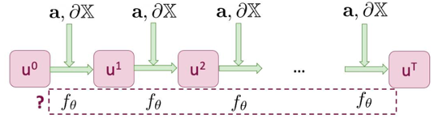
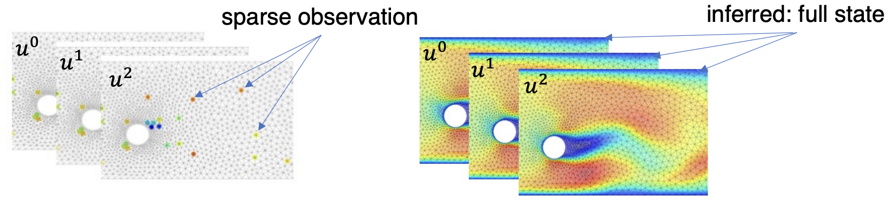
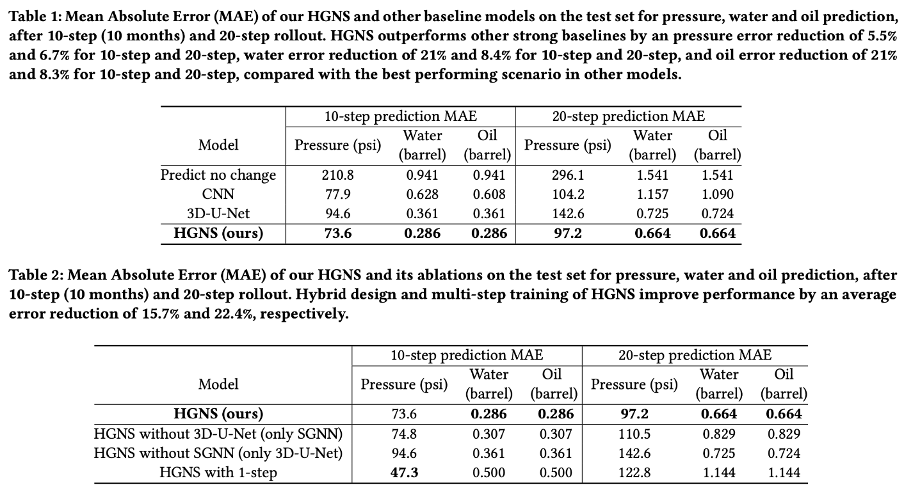

# eth-CSEseminarRobotics

Last updated: **03-05-2023**

**Topic**: GNN-based simulation and its application

## Outline

- *The first question to discuss is why we want to learn the simulation?*
  - **Speed**. Weather Forecasting[^1][^2]. Engineereed simulators need substantial effort to build and resources to run.
  - **Generalization**. For engineered simulators. Different problems may need different kinds of simulators, specific simulator is only as accurate as the model. However, learned simulators can be reusable general architectures. Additionally, can be as accurate as teh available data (real-world data).
  - **Differentiability**. Gradient-based search for control[^3], inverse design[^4] and inference, etc.
  - **Learn unkown physics**. compensate for unknown models/parameters: some learned model sub-components can be interpreted [^5]. And there are lots of work (AI for scientific discovery) related to interpretability using symbolic regression.
  - **Distill reusable modules**. Distill a learned model that can be easily deployed on modern accelerator hardware

[^1]: [GraphCast: Learning skillful medium-range global weather forecasting](https://arxiv.org/abs/2212.12794)
[^2]: [FourCastNet: A Global Data-driven High-resolution Weather Model using Adaptive Fourier Neural Operators](https://arxiv.org/abs/2202.11214)
[^3]: [Learning Particle Dynamics for Manipulating Rigid Bodies, Deformable Objects, and Fluids](https://arxiv.org/abs/1810.01566) citations: 231 since 2019
[^4]: [Inverse Design for Fluid-Structure Interactions using Graph Network Simulators](https://openreview.net/pdf?id=HaZuqj0Gvp2)
[^5]: [Learning Symbolic Physics with Graph Networks](https://arxiv.org/abs/1909.05862) citations:57 since 2019

- *Why GNN? What is the advantage of it?*
  - **Advantage 1:** (most important!) Inductive basis in the Graph make it good at generalization!
    - **Explain:** When we use a machine learning model to approximate a simulator, it is less clear whether the model learn the actual physics (underlying physical equations), or it's just fitting and interpolating a curve? If it just learns a curve, the model will be bad at extrapolation or domain shift of the input distribution. There is no way we can build a dataset that covers the input space of a general-purpose simulator. Therefore, we want to impose inductive biases[^6] to the structure of the learning setup which allows a learning algorithm to prioritize one solution (or interpretation) over another. And GNN is a good candidate to learn the real physics (reusable knowledge, similar to physical laws), and applied far outside the data that it was trained. Also, it is convient to enforce some constraints in the graph.
    - 
    - Here, we list some advantages (inductive biases) of GNN[^7] as a physics simulator
      - Inductive bias $\rightarrow$ Prior for generalization: much more efficient and can generalize much better to unseen sencarios. 
        - Permutation equivariance (not ordering, If a MLP, we will impose a ordering inevitably.) 
        - Pairwise message: Pairwise interactions, universal rules
        - message passing framework $\rightarrow$ superposition principle, local interactions, universal rules.

  - **Advantage 2:** message passing framework $\rightarrow$ shared update function for edges and nodes $\rightarrow$ less parameters to train and high Sample and training efficiency.[^3]

[^6]: [Relational inductive biases, deep learning, and graph networks](https://arxiv.org/abs/1806.01261) citations:2607 since 2018
[^7]: [Interaction Networks for Learning about Objects, Relations and Physics](https://arxiv.org/abs/1612.00222) citations:1275 since 2016

- *Therefore, let's introduce the progress of GNN based simulator in these years*

The mainstream framework in this field is the next step prediction model (Autoregressive model)[^8]. Additional, there are two other frameworks including PINN and neural operators, which I will not discuss in this review. Dynamics modeling for particles: $z_{t+1} = z_t + f(t,z_t,u_t)$.

- **GNN-based simulator:**
  - $u^t$: State of the system. Represented as a graph. (mesh, particles, molecules)
    - If the graph is generated by the particle, then the edge is defined by the proximity criterion. 
  - $f_\theta$: message-passing graph neural network
    - shared update function for node and edge

Among 2016-2018, there are a series of work[^7][^9][^10] from Deepmind and MIT, which represents the scene as a graph and model the interactions using graph neural network. However, they only studied relatively small domains: ~10 of bodies, ~100 of steps. 

Can the graph net simulators scale to real-world complexity (orders of magnitude $\rightarrow$ particles and time steps)? In 2019, Li et al.[^11] studied the system with larger system, and achieved the closed-loop feedback control using the learned GNN model (apply model-predictive control optimized using gradient descent.). 

Then, Researchers from DeepMind build the high-quality general-purpose simulator (GNS)[^12] which can simulate the dynamics of fluid, rigid solids and deformable materials. The simulated system is consist of up to 85k particles, and stable for thousands of time steps. Additionally, their work shows strong generalization for larger domains, intial conditions and unseen data. 

However, the limitations of their work is the stability of elastic materials. In GNS, the particle-based model constructed the graph based on proximity creiterion. But some systems are not well established in particles. Can we learn from simulations with connectivity (e.g. FEM)? This is the motivation of meshgraphnet[^13], where the connectivity is already built in the data set. Compared with GNS, the error accumulation is stable for elastic materials (Flagsimple) , no simulation explosion.

GNS and MeshGraphNet are the most importants progress in this field. After that, the community mainly focused on the following two directions:

- **Model improvement**
- **Application of GNN-based solver for downstream task**

==For model improvement, I summarized the following prospectives:==

1. **Control the error accumulation in the iteration**: The key problem for this autoregressive model is that the simulation may explode due to the error accumulation. This can be interpreted as overfitting to the one-step training distribution, and thus being prone to generalize poorly if the input shifts from this, which is usually the case after a few rollout steps. In GNS and Meshgraphnet, the author injected the noise into the training data such that they can better learn the distribution shift. However, this method is not stable and may break down in many cases. Therefore, researchers propose following techniques:

   1. incorporating the temporal model and capture the long-term dependencies[^14]

      

   2. Multi-step prediction[^15]: HGNS

      

   3. Annealed multi-step learning objective: Graphcast[^16]

      

      - 先是一步的预测，模型训练好后再用一步的模型做两步的预测从而进一步训练减少mse，最后一直是12步，这种方法可以让他们的loss减小的很多。

2. **Large-scale**

   1. HGNS[^15]: Super large-scale simulation: realistic 3D scenarios with up to 1.1 million cells per time step (two orders of magnitude higher than prior models).
      1. Apply the sector-based training, which allows HGNS to learn on datasets with at least two orders of magnitude more nodes than GNS - This is mainly due to the reason that no matter GNN and Unet, it has the characteristics of the local interaction: `both the SGNN and the 3D- U-Net are “local” models, meaning that to predict the cell’s state at 𝑡 + 1, we only need a cell’s neighbors up to a certain distance away, instead of the full grid. Based on this observation, we partition the full grid into “sectors”`
   2. GraphCast[^16]: Super-scale: 1, 038, 240 nodes. Every nodes have 227 variables. In total, the state representation contains 235, 680, 480 values.

3. **Higher Resolution (multiscale)**

   1. MultiScale MeshGraphNets[^16][^17][^18]: The idea is very simple. Because the message-passing is local, which can only capture the local interaction. Build graph with different resolutions to capture the long-range interactions.

      

4. **Encode more physics priori into the GNN for better accuracy** 

   1. Pure data-driven deep learning models suffer from error accumulation and poor generalizability when predicting complex physical processes. A more promising way is to leverage our prior physics knowledge in scientific deep learning models. Encoding Physicals (PDE), symmetry and conservations law in the GNN to enforce the roboustness of the GNN. There are many methods combined in this field, including the PINN (weakly enforcement), and Mike, han gan et al. have works in this field. I won't discuss the physics priori as the loss function in this review. **I will mainly focused on the hard enforcement, that is encoding the physics priori knowledge into the neural network architecture.**

   2. Conservation of Momentum[^19]: when simulating the particle dynamics, the conservation of momentum is especially important

   3. Symmetry[^20][^21]: The data inherently have the symmetry information.

      

==For Application of GNN-based solver for downstream task, I sorted out the following prospectives:==

1. **Robotics control (Sim-to-Real)**:  

   1. RoboCraft[^22]:*Learn the model from the observed data by camera in the real word.* And use the learned model to manipulate the elasto-plastic objects. The manipulation process is based on the control model in this paper. `Learning Particle Dynamics for Manipulating Rigid Bodies, Deformable Objects, and Fluids`
      - Training data collection:
        - ~12 seconds for a trial (3 grips) $\times$ 50 trials = ~**10 minutes** of training total
   2. GGNS[^23]: *Use the real world data to fix the GNN simulator.* 

2. **Inverse Design**: 

   1. inverse design of boundary and system parameters[^24]:First paper that used GNN for inverse design
      1. Because we know that the learned GNN model is Differentiable. We can do inverse design which combines learned forward simulators based on graph neural networks with gradient-based design optimization. In this paper, the author designed surfaces and tools to manipulate fluid flows and optimizing the shape of an airfoil to minimize drag.

   2. State/parameter Estimation[^25]: inferring unknown system states/parameters

      1. optimize MSE[$\hat{u}^t(x),u^t(x)$] w.r.t. initial state $u^0$ or parameter $a$, given sparse observation of $u^t(x)$ at certain locations $x\in\Omega$

         

[^8]: Figure from this page: [AI Physicist & machine learning for simulations](https://drive.google.com/file/d/1cYFChLUVJZakZhnF81kNlS14WBV2HnQL/view)
[^9]: [A Compositional Object-Based Approach to Learning Physical Dynamics](https://arxiv.org/abs/1612.00341) citations: 422 since 2016
[^10]: [Graph networks as learnable physics engines for inference and control](https://arxiv.org/abs/1806.01242) citations: 539 since 2018
[^11]:[Learning Particle Dynamics for Manipulating Rigid Bodies, Deformable Objects, and Fluids](https://arxiv.org/abs/1810.01566) citations: 231 sincee 2019
[^12]:[Learning to Simulate Complex Physics with Graph Networks](https://arxiv.org/abs/2002.09405) citations: 610 since 2020
[^13]: [Learning Mesh-Based Simulation with Graph Networks](https://arxiv.org/abs/2010.03409) citations: 329 since 2021
[^11]: [Predicting Physics in Mesh-reduced Space with Temporal Attention](https://arxiv.org/abs/2201.09113) citations: 17 since 2022
[^12]: [Learning large-scale subsurface simulations with a hybrid graph network simulator](https://arxiv.org/abs/2206.07680) citations: 4 since 2022
[^13]: [GraphCast: Learning skillful medium-range global weather forecasting](https://arxiv.org/abs/2212.12794) citations: 15 since 2022
[^14]: [MultiScale MeshGraphNets](https://arxiv.org/abs/2210.00612) citations: 9 since 2022
[^15]: [Efficient Learning of Mesh-Based Physical Simulation with Bi-Stride Multi-Scale Graph Neural Network](https://arxiv.org/abs/2210.02573) citations: 4 since 2023
[^16]: [Guaranteed Conservation of Momentum for Learning Particle-based Fluid Dynamics](https://arxiv.org/abs/2210.06036)
[^17]: [E(n) Equivariant Graph Neural Networks](https://arxiv.org/abs/2102.09844) citations: 210 since 2021
[^18]: [Geometrically Equivariant Graph Neural Networks: A Survey](https://arxiv.org/abs/2202.07230) citations: 21 since 2022
[^19]:[RoboCraft: Learning to See, Simulate, and Shape Elasto-Plastic Objects with Graph Networks](https://arxiv.org/abs/2205.02909) citations:10 since 2022
[^20]: [Grounding Graph Network Simulators using Physical Sensor Observations](https://arxiv.org/abs/2302.11864) 
[^21]:[Physical design using differentiable learned simulators](https://arxiv.org/abs/2202.00728) citations:17 since 2022
[^22]: [Learning to solve pde-constrained inverse problems with graph networks](https://arxiv.org/abs/2206.00711) citations 6 since 2022

关于ppt的制作，可以采用那种把一个整体大纲的网络图放在每一个topic开头，每次讲到这个topic了，这部分就发亮，其他部分是暗的。

## Paper Notes

### GNN simulator

- **Relational inductive biases, deep learning, and graph networks**. *DeepMind, Google Brain, MIT, University of Edinburgh*. **Arxiv 2018**.([PDF](pdf/GNN-Inductive_biaes.pdf)) 
  - **Materials:**
    - [Report](https://www.youtube.com/watch?v=56e104J4ehA), [Slide](http://www.pair.toronto.edu/csc2547-w21/assets/slides/CSC2547-W21-3DDL-Relational_Inductive_Biases_DL_GN-SeungWookKim.pdf), [Comment](https://zhuanlan.zhihu.com/p/261081574), [Peter Battaglia](https://scholar.google.com/citations?user=nQ7Ij30AAAAJ)
  
- **Interaction Networks for Learning about Objects, Relations and Physics**. *Arxiv*. **NeurIPS 2016**. ([PDF](pdf/GNN-interaction_GNN.pdf))([Arxiv](https://arxiv.org/abs/1612.00222))
  - **Motivations:**
    - MLPs operate over vectors, Neural networks that operate over graphs
      - 
  - **Main Contribution:**
    - Relational inductive biases: physical system as a graph
    - Learning message-passing
  - **Setup:**
    - 
  - **Materials:**
    - code: [Github](https://github.com/higgsfield/interaction_network_pytorch); [Report1](https://www.youtube.com/watch?v=8v27_jzNynM) [Report2](https://www.youtube.com/watch?v=dtPcqEnLvqc&t=1664s)
- **Graph Networks as Learnable Physics Engines for Inference and Control**. *Alvaro Sanchez-Gonzalez, Nicolas Heess, Jost Tobias Springenberg, Josh Merel, Martin Riedmiller, Raia Hadsell, Peter Battaglia*. **ICML 2018** ([PDF](pdf/GNN-GNNphysicalEngine.pdf)) ([Arxiv](https://arxiv.org/abs/1806.01242))
  - **Main Contribution:** Graph Nets to simulate & control Mujoco systems
    - Articulated dynamics
    - 
- **Learning Particle Dynamics for Manipulating Rigid Bodies, Deformable Objects, and Fluids**. *Yunzhu Li, Jiajun Wu, Russ Tedrake, Joshua B. Tenenbaum, Antonio Torralba*. **ICLR 2019** ([Arxiv](https://arxiv.org/abs/1810.01566)) ([PDF](pdf/GNN-learn_predictive_dynamics.pdf))
  - ==在仔细研究研究这篇和GNS在framework上的不同==
  - 
    - 利用了系统的组合特性，节点编码函数在所有节点中共享，边编码函数在所有的边中共享。因此学习模型可以推广到不同大小的系统，甚至在训练分布之外都有很好的泛化能力
  
  - **Main Contribution:**
    - inductive basis使得模型具有更好的泛化能力
    - 节点和边的共享函数使得模型训练的效率也大大提升
    - 获得动力学模型后，下一个问题是如何将其用于控制任务，学习模型可微的神经网络。提取梯度，基于梯度来优化动作对象。并利用model-predictive control的框架来处理我们和环境之间的反馈。模型可能不够准确，所以我们只执行模型预测控制。只执行第一个动作$u_0$，然后从环境中获得一个新的状态$z_1$。
    - 
  - **Materials**
    - [Personal website](https://yunzhuli.github.io/#Honors); [Phd thesis](https://www.youtube.com/watch?v=8eof6F4-r0k); [Report1](https://www.bilibili.com/video/BV1E84y1B79i/?spm_id_from=333.337.search-card.all.click&vd_source=1d46d083dae85b6b2c01926780b0438b);[Theme share](https://mp.weixin.qq.com/s/ZrJ0IRNrNZG6yXFEy8_ONQ)
- **Learning to simulate complex physics with graph networks**. *Alvaro Sanchez-Gonzalez, Jonathan Godwin, Tobias Pfaff, Rex Ying, Jure Leskovec, Peter W. Battaglia*. **ICML 2020** ([PDF](pdf/GNN-GNS.pdf))([Arxiv](https://arxiv.org/abs/2002.09405)) (Citations **540**)

  - **Model Framework**

    - 
    - Encoder: 
      - input features: position; previous 5 velocities; particle type
      - Embed features with MLPs
      - Construct neighbourhood graph|consturt graph $\rightarrow$ the number of dimensions don't change.(graph中vertices的数目和输入的点数目一致) 
    - Processor (x10):
      - Edge function: MLP
      - Node function: MLP
      - Here, processor are just interaction networks
    - Decoder:
      - Extract acceleration
      - Feed into Euler integrator
      - Decoder中，他们认为可以将这个方法和任意的integrator结合。但这里为了简化，用的是Euler integrator
    - **Inference:** autoregressively rollout for hundreds of steps

    - 其实，这里通过proximity构建graph的逻辑就有点像流体力学里面的拉格朗日和欧拉两种坐标系。一种是追踪particle，另一种是固定流场区域，从而追踪流场中每个点的物理量。

    - train on 1 step, rollout 1000s steps
  - **Training:** trained with 1-step prediction, minimizing MSE. To improve long-term prediction, add Gaussian noise on the input.  
  
    - $\epsilon \sim N(0,1), \sigma$: amplitude of noise on each feature
  
  - **Results:**
  - Very good at simulating fluid-like stuff, hard to simulate elasticity. That is reason why they propose meshgraphnet subsequently.
    - **Generalization:** learn some underlying physics, not just interpolating or overfitting. Generalization to significantly more particles.
      - Inductive biases:
        - shared node, edge functions: dynamics is the same for all particles
        - Relative encoding: absolute position is never observed. Only position difference to neighbors
      - Effects:
        - Reduced input space, observing translational symmetry
        - Effectively more train data; each particle is a "sample"
        - Less likely to overfit, more likely to generalize out-of-distribution
    - **Key architectural choices:**
      - Message passing steps + connectivity radius: performance/accuracy tradeoff
    
    - 
    
    - 核心意思是说message passing能够传的更远，所以系统能够学到一些information
  - **Related work and baselines:**
  
    - continuous convolutions ICLR 2020: only liquids (strong bias for liquids, not well for materials that are not liquids)
    - DPI-Nets ICLR 2019: hardcoded constraints (就是在模拟的时候告诉simulator，对于一些刚形体，其不能变形，里面的点距离不能变）
    - try to provide a very general useful framework
      - 这些baseline的比较论文中都有提及
  - **Limitations:**
  
    - stability of elastic materials $\rightarrow$ learning from simulation with connectivity **Meshgraphnet**
    - Inference time $\rightarrow$ taking large time steps, spatial/temporal adaptivity **Meshgraphnet**
      -  ==inference time is out of magnitude than that ground truth simulator?==这篇文章并不是目标提升速度，而是focused on accuracy and generality。因此还有很大的空间对速度进行提升。
    - Prediction from states $\rightarrow$ Combining with mesh generation from images
      - 这个预测是基于particles的states，你的输入是states，输出也是states，it doesn't work automatically from images
    - How far can this model scale up? Can it do millions of particles?
  - **Materials:** 

    - Lecture
      - [DDPS|Learning physical simulation with graph network](https://www.youtube.com/watch?v=dtPcqEnLvqc)
      - [Learning to Simulate Complex Physics with Graph Networks](https://www.youtube.com/watch?v=8v27_jzNynM&t=464s)
      - [Discussion](https://www.zhihu.com/question/533023700)
- **Learning Mesh-Based Simulation with Graph Networks**. *Tobias Pfaff, Meire Fortunato, Alvaro Sanchez-Gonzalez, Peter W. Battaglia*. **ICLR 2021 spotlight** ([PDF](pdf/learning_mesh_based_simulation.pdf))
  - **Task and framework:** Mesh-based simulation
    - 
  - **Main contribution:** Introduced MeshGraphNets:
    - World-space edges + dual space message passing
      - external dynamics: computing e.g. collision and contact
      - internal dynamics: estimating differential operators on the simulation manifold
    - Supervised remeshing
    - Adaptive remeshing
      - Decide resolution at each spatial point
        - sizing field tensor
        - domain specific
      - Adjust mesh to sizing field constraints
        - Pure optimization problem
        - Domain independent
      - **This sizing field is learnt from the data**
  - **Results:** accurate prediction on many different systems.
  - **Limitations & future work**
    - Adaptivity
      - Optimize for downstream task
      - use to deal with extremely large-scale simulation data
    - Training noise
      - very effective, but not well understood, needs tuning
    - How can they use this model beyond prediction
      - use in design optimization or MBRL
    - Apply to data from real-world sensors
      - Camera images, depth, point clouds, satellite data.
  - **Related work**
    - Mesh-free methods
      - GNS: ICML 2020
      - DPI-Nets: ICLR 2019
    - Grid-based methods
      - UNets: Thurey et al. 2020
      - CNNs: Bhatanagar et al. 2019
      - Other GNN architectures
        - GCNs, e.g. [Belbute-Perees et al. 2020]
  - **Materials:**
    - Lecture: [Tobias Pfaff](https://www.youtube.com/watch?v=fLo39PSLvsw&t=2989s)

### Model Improvement

#### Control Error Accumulation

- **Predicting Physics in Mesh-reduced Space with Temporal Attention**. *Xu Han, Han Gao, Tobias Pfaff, Jian-Xun Wang, Li-Ping Liu*. **ICLR 2022**. ([PDF](pdf/GNN-predicting_physics_in_mesh_red.pdf)) ([OpenReview](https://openreview.net/forum?id=XctLdNfCmP)) 
  - **Architecture:**
    - 
      - selecting the pivotal nodes. $\rightarrow$ The encoder GMR runs Message passing along graph edges so that the pivotal nodes collect information from nearby nodes. $\rightarrow$ The latent vector $z_t$ summarizes information at the pivotal nodes, and represents the whole domain at the current step. $\rightarrow$ The transformer will predict $z_{t+1}$ based on all previous state latent vectors. $\rightarrow$ do the interpolation for other nodes.

  - **Main Contributions:** demonstrate stable rollouts without the need for training noise and show perfectly phase-stable predictions even for very long sequences.
    - introduced a graph-based mesh reduction method, together with a temporal at- tention module, to efficiently perform autoregressive prediction of complex physical dynamics.

    - pave the way to bring the benefits of attention-based sequence models to solve high-dimensional complex physics tasks.

  - **Results:**
    - 在时间模型上测试了三种：three variants of the model (LSTM, GRU, or Transformer)，发现transformer更好，并且于noise injection (NI)和没NI的meshgraphnet进行了对比
      - 

    - By attending to whole simulation trajectories, our method can more easily identify conserved properties or fundamental frequencies of the system, allowing prediction with higher accuracy and less drift compared to next-step methods.

#### Large-Scale

- **Learning large-scale subsurface simulations with a hybrid graph network simulator**. *Tailin Wu, Qinchen Wang, Yinan Zhang, Rex Ying, Kaidi Cao, Rok Sosič, Ridwan Jalali, Hassan Hamam, Marko Maucec, Jure Leskovec*. **SIGKDD 2022** ([PDF](pdf/GNN-HGNS.pdf)) ([Website](http://snap.stanford.edu/hgns/))(Citations **4**)
  - **Architecture:**
    - 
  - **Task:** Subsurface fluid simulation (critical in energy, carbon capture, etc.)
  - **Main contribution:** Introduced HGNS for fluid simulation, which use
    - Super large-scale simulation: realistic 3D scenarios with up to 1.1 million cells per time step (two orders of magnitude higher than prior models).
    - multi-step prediction during training to improve long-term prediction accuracy. outperforms other learning-based models by reducing long-term prediction errors by up to 21%, and can accurately predict the fluid flow for tens of time steps (years into the future).
      - 
    - To address that the state size is too huge and cannot put inside a single GPU, introudce Sector-based training and inference, with partitions the full grid into overlapping sectors (as subgraphs) and randomly combine minibatch of sectors as training examples.
  - **Results:** Up to 18x faster than classical solver. Apply to 10million cells per step. Deployed in industry
    - 
- **GraphCast: Learning skillful medium-range global weather forecasting**. *Peter Battagliac et. al. DeepMind*. **Arxiv 2022** ([PDF](https://arxiv.org/pdf/2212.12794.pdf))
  - **Task:** Weather forecasting (mid-range, 10-day)
  - **Architecture:**
    - 
  - **Main contribution:** GraphCast by DeepMind outperforms traditional methods in accuracy for 10-dayforecast.Takes only 60s to predict on a TPU, while traditional method takes 1h running on11,664CPUcores.
    - Multi-scale GNN
      - 可以模拟不同距离信息（远、近信息的传递）的message-passing。一般的模型直接在最细的网格上做message passing，但是，有些信息可能会受到很远处扰动的影响，这个时候你用local message-passing可能就无法捕捉到远处的一些扰动影响。天气：压强传的很快，但是像降雨这些穿的较慢。
    - Annealed multi-step learning objective 
      - 先是一步的预测，模型训练好后再用一步的模型做两步的预测从而进一步训练减少mse，最后一直是12步，这种方法可以让他们的loss减小的很多。
    - Super-scale: 1, 038, 240 nodes. Every nodes have 227 variables. In total, the state representation contains 235, 680, 480 values.
  - **Results:** outperforms state-of-the-art weather forecasting method (HRES) in 10-day prediction acc. 

#### High-Resolution (Multiscale GNN)

- **MultiScale MeshGraphNets**. *Meire Fortunato, Tobias Pfaff, Peter Wirnsberger, Alexander Pritzel, Peter Battaglia*. **ICML 2022 AI4Science Workshop** ([PDF](pdf/GNN-multiscale_meshgraphnet.pdf))
  - **Motivation:** MeshGraphNets relies on a message passing graph neural network to propagate information, and this structure becomes a limiting factor for high-resolution simulations, as equally distant points in space become further apart in graph space. Therefore, the author introduce a hierarchical approach (MultiScale MeshGraphNets) which passes messages on two different resolutions (fine and coarse), significantly improving the accuracy of MeshGraphNets while requiring less computa- tional resources.
    - ==这个工作其实就是GraphCast的一个小点，GraphCast是一个集大成之作==
  - **Architecture:**
    - 
- **Efficient Learning of Mesh-Based Physical Simulation with Bi-Stride Multi-Scale Graph Neural Network**. *Yadi Cao, Menglei Chai, Minchen Li, Chenfanfu Jiang*. **ICML 2023** ([Arxiv](https://arxiv.org/pdf/2210.02573.pdf))

#### Physics Priori

- **Geometrically Equivariant Graph Neural Networks: A Survey**. *Jiaqi Han, Yu Rong, Tingyang Xu and Wenbing Huang*. **Arxiv 2022** ([PDF](pdf/GNN-EGNN_review.pdf))
  - **Materials:**
    - [Lecture](https://www.bilibili.com/video/BV1tM411b7rS/?spm_id_from=333.337.search-card.all.click&vd_source=1d46d083dae85b6b2c01926780b0438b)
- **Guaranteed Conservation of Momentum for Learning Particle-based Fluid Dynamics**. *Lukas Prantl, Benjamin Ummenhofer, Vladlen Koltun and Nils Thuerey*.  ([PDF](pdf/GNN-Momentum_conserved_CConnv.pdf))([OpenReview](https://openreview.net/forum?id=6niwHlzh10U))
- **E(n) Equivariant Graph Neural Networks**. *Victor Garcia Satorras, Emiel Hoogeboom, Max Welling*. **ICML 2021** ([PDF](pdf/GNN-Equivariant_GNNs.pdf))([Arxiv](https://proceedings.mlr.press/v139/satorras21a.html))\

### Application

#### Robotics (Sim-to-Real)

- **RoboCraft: Learning to See, Simulate, and Shape Elasto-Plastic Objects with Graph Networks**. *Haochen Shi, Huazhe Xu, Zhiao Huang, Yunzhu Li, Jiajun Wu*. **RSS 2022** ([PDF](pdf/GNN-RoboCraft.pdf))([Website](http://hxu.rocks/robocraft/))([Arxiv](https://arxiv.org/abs/2205.02909)) 
  - **Motivation:**
    - Sim-to-real transfer: model learned from a physics-based simulator
    - In the real work:
      - 3D reconstruction
      - Online adaptation
  - **Contribution:** Remove the dependence on the physical simulator and directly learn the model from data. 
  - **Experiment setup**
    - 
      - Learn the model from the observed data by camera in the real word. And use the learned model to manipulate the elasto-plastic objects. The manipulation process is based on the control model in this paper. `Learning Particle Dynamics for Manipulating Rigid Bodies, Deformable Objects, and Fluids`
    - Loss function:
      - 
      - 🤖️领域，大家都很关心真实世界中的实验结果。但是，并没有一个模拟器可以模拟周围的一切系统，在这个角度上来看，这里面的GNN-based simulator就可以当作是一个潜在的通用模型。这里，作者希望从真实的世界中学习动力学模型。但是，这其中有一个问题是，真实世界和模拟器中的不同在于，我们用3D reconstruction和online adaption采取了真实世界中的点集，下一时刻又采样另一组点集，我们并不知道点与点之间的对应关系，那么，如何写我么的loss function呢？
    - Training data collection:
      - ~12 seconds for a trial (3 grips) $\times$ 50 trials = ~**10 minutes** of training total
  - **Materials:** [Report](https://www.youtube.com/watch?v=8eof6F4-r0k&t=1s)
- **Grounding Graph Network Simulators using Physical Sensor Observations**. *Jonas Linkerhägner, Niklas Freymuth, Paul Maria Scheikl, Franziska Mathis-Ullrich, Gerhard Neumann*. **ICLR 2023** ([PDF](pdf/GNN-GGNS.pdf))([Arxiv](https://arxiv.org/abs/2302.11864))([Code](https://github.com/jlinki/GGNS))([OpenReview](https://openreview.net/forum?id=jsZsEd8VEY))
  - make use of such additional information only when provided, and resorts to a standard Graph Network Simulator, otherwise.

#### Inverse Design

- **Physical design using differentiable learned simulators.** *Kelsey R. Allen, Tatiana Lopez-Guevara, Kimberly Stachenfeld, Alvaro Sanchez-Gonzalez, Peter Battaglia, Jessica Hamrick, Tobias Pfaff*. **NeurIPS 2022** ([PDF](pdf/GNN-Physical-design.pdf))
  - **Task**: Explore a simple, fast, and robust approach to inverse design which combines learned forward simulators based on graph neural networks with gradient-based design optimization.
    - **Experiments:** designing surfaces and tools to manipulate fluid flows and optimizing the shape of an airfoil to minimize drag.
- **Learning to solve pde-constrained inverse problems with graph networks**. *Zhao, Qingqing, David B. Lindell, and Gordon Wetzstein*. **ICML 2022**

#### PDE solver

- **Message Passing Neural PDE Solvers.** *Johannes Brandstetter, Daniel Worrall, Max Welling*. **ICLR 2022** ([PDF](pdf/GNN-MPNNPDE.pdf))([Comment](https://mp.weixin.qq.com/s/pt0MPu1WkxhFY1fmBZ35rA))([OpenReview](https://openreview.net/forum?id=vSix3HPYKSU))
  - 
